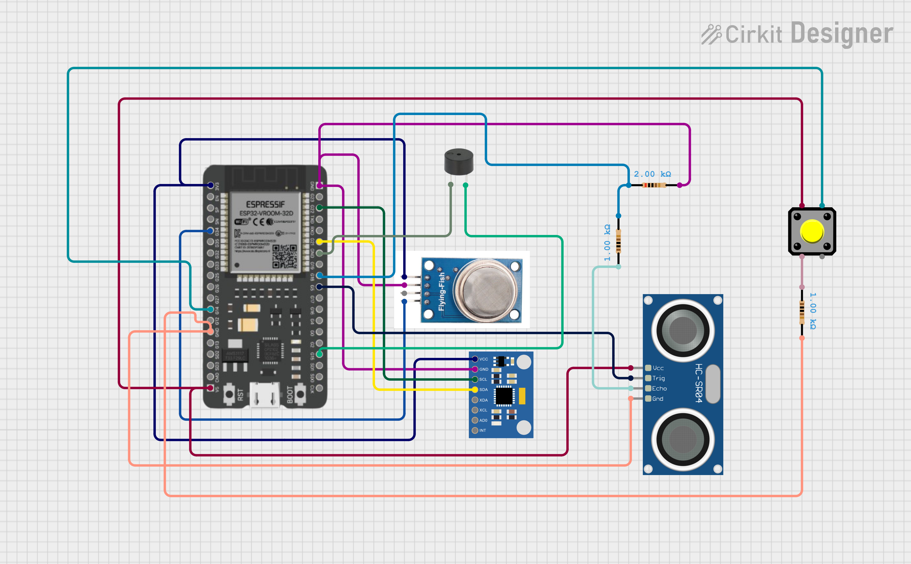

# AquaLogic – IoT-based Smart Disaster Monitoring System

---

## Team Members
- Kedar Hukkeri
- Shubham Bagodi
- Raghavendra Urankar
- Hruishikesh Karamadi

---

## Problem Statement
Natural disasters like floods, gas leaks, and land vibrations are unpredictable and often deadly. Traditional detection methods are manual or delayed. There is an urgent need for timely, automated alerting systems that reduce impact and improve emergency response.

---

## Solution Overview
AquaLogic is an IoT-powered early warning and monitoring system combining multi-sensor hardware, cloud connectivity, and real-time notifications. The system continuously tracks environmental parameters and issues instant alerts through SMS and email when hazardous thresholds are exceeded.

---

## Key Features
- Real-time flood level detection
- Gas leakage monitoring
- Seismic vibration sensing
- Automatic SMS alerts via Twilio
- Email notifications via Gmail SMTP
- Local buzzer alarm for immediate awareness
- Manual reset button
- Optional dashboard deployed via Cloudflare

---

## Technologies & Components Used

| Component | Purpose |
|---|---|
| **ESP32** | Main microcontroller |
| **Ultrasonic Sensor (HC-SR04)** | Water level measurement |
| **Gas Sensor (MQ135)** | Air quality/gas detection |
| **MPU6050** | Tilt, motion, vibration detection |
| **Buzzer** | Audible alerts |
| **Push Button** | System reset |
| **Twilio** | SMS alert service |
| **Gmail SMTP** | Email notifications |
| **Cloudflare** | Frontend deployment |
| **Arduino IDE** | Firmware development |

---

---

## Circuit Diagram

<p align="center">
  
</p>

---


## Sustainable Development Goals (SDGs)

AquaLogic contributes to the following UN SDGs:

- **SDG 9 – Industry, Innovation and Infrastructure:** Builds resilient, scalable IoT infrastructure.
- **SDG 11 – Sustainable Cities and Communities:** Enhances disaster resilience.
- **SDG 13 – Climate Action:** Supports adaptation to climate-induced disasters.

---

## How to Run / Test the Project

1. **Flash ESP32:**
   - Open `code/main.ino` in Arduino IDE.
   - Fill in:
     - WiFi SSID and password.
     - Twilio credentials (SID, Auth Token, Twilio number).
     - Gmail SMTP credentials (email, App Password).
   - Upload the sketch to the ESP32.

2. **Twilio Setup:**
   - Create an account at [twilio.com](https://www.twilio.com).
   - Generate your Account SID and Auth Token.
   - Verify recipient phone numbers if on a free plan.

3. **Gmail SMTP Setup:**
   - Enable 2-Step Verification in Gmail.
   - Generate an App Password [here](https://myaccount.google.com/apppasswords).
   - Use this password in your Arduino code instead of your regular password.

4. **Cloudflare Deployment (Optional):**
   - Configure a dashboard to visualize sensor data.

5. **Test the System:**
   - Simulate high water levels, gas presence, or vibrations.
   - Confirm SMS, email, and buzzer alerts are triggered.

---

## Repository Structure

```
aqualogic/
├── code/
│   └── main.ino
├── Circuit_image.png
├── LICENSE
├── README.md
├── .gitignore
└── requirements.txt
```

---

## License

This project is licensed under the [Apache License 2.0](LICENSE).  
All dependencies are open-source with OSI-approved licenses.

---

## Acknowledgments

- Infosys Global Hackathon 2025
- Twilio, Arduino, and open-source communities
- United Nations Sustainable Development Goals for inspiration
